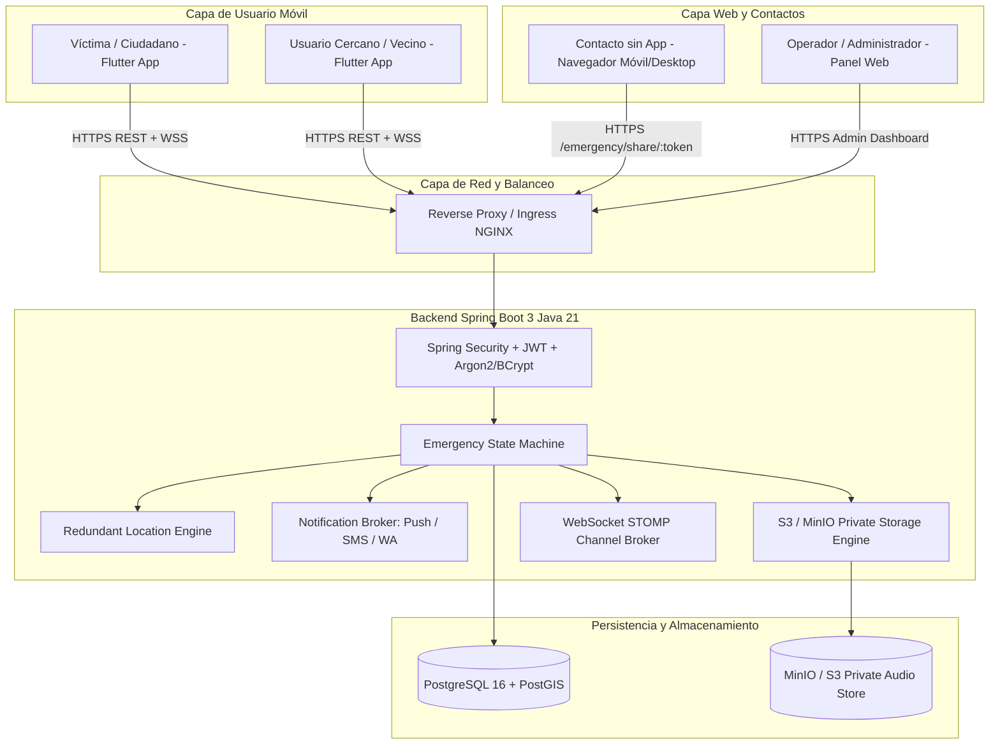
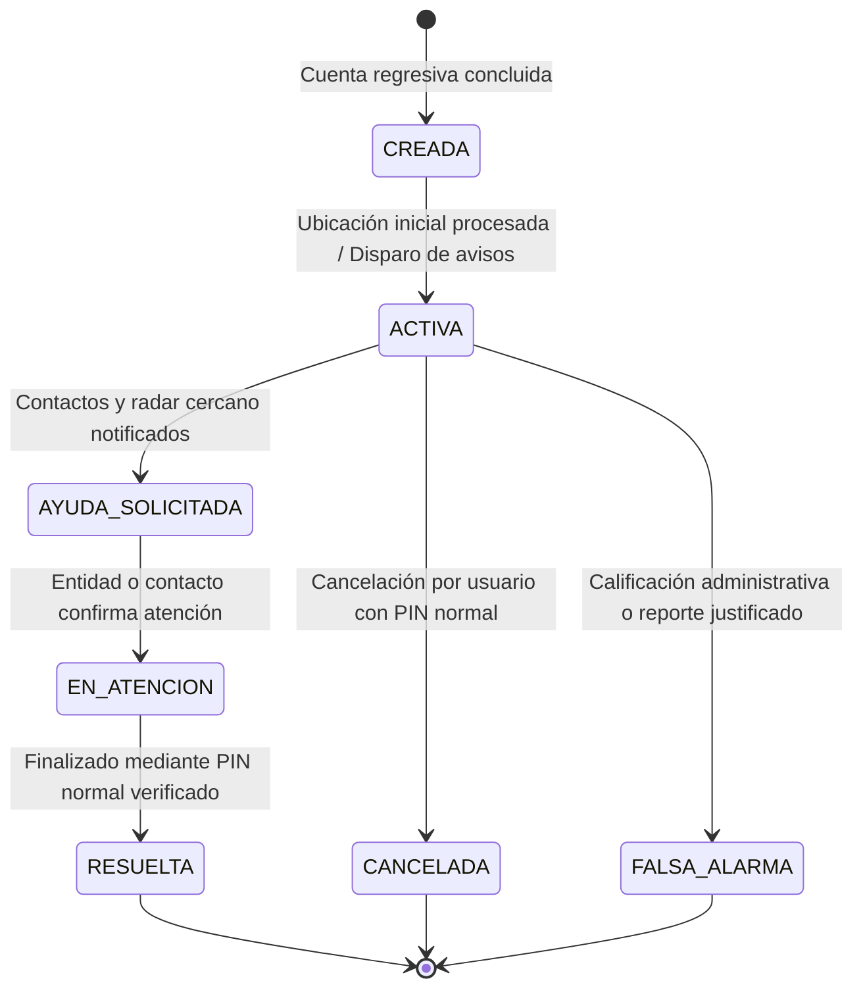

# RED AYUDA — PLAN MAESTRO DE ARQUITECTURA Y CONSTRUCCIÓN
*Lema: "Una población organizada, una ciudad más segura"*
*Región inicial: Ayacucho, Perú (Escalable a nivel nacional)*

---

## 1. Misión y Alcance del Sistema
RED AYUDA es una plataforma tecnológica integral de alerta temprana, coordinación ciudadana y respuesta ante emergencias civiles, médicas y de seguridad ciudadana.
Diseñada bajo los más altos estándares de resiliencia, privacidad de datos y minimización de exposición sensible.

### Límites de Responsabilidad y Políticas
- **No sustitución de entidades oficiales**: RED AYUDA es un canal facilitador y coordinador. No sustituye la labor de la Policía Nacional del Perú (PNP - 105), Sistema de Atención Móvil de Urgencia (SAMU - 106), Cuerpo General de Bomberos Voluntarios del Perú (CGBVP - 116), ni Serenazgo Municipal.
- **Seguridad ciudadana preventiva**: El sistema no promueve ni incentiva la confrontación civil frente a delincuentes o siniestros graves.
- **Privacidad estricta**: Los datos del DNI, números telefónicos privados y grabaciones de audio de emergencia se consideran información altamente confidencial. Nunca se difunden a usuarios cercanos ni de forma no autenticada.

---

## 2. Arquitectura Global de Componentes

---

## 3. Modelo de Entidad-Relación y Persistencia (PostgreSQL)

### Esquema Relacional Normalizado:
1. `usuarios`:
   - `id`: UUID PRIMARY KEY
   - `dni`: VARCHAR(12) UNIQUE NOT NULL (Índice hash, sensible)
   - `nombres`: VARCHAR(100) NOT NULL
   - `apellidos`: VARCHAR(100) NOT NULL
   - `telefono`: VARCHAR(20) NOT NULL
   - `email`: VARCHAR(150) UNIQUE NOT NULL
   - `password_hash`: VARCHAR(255) NOT NULL
   - `pin_hash`: VARCHAR(255) (PIN normal de 4-6 dígitos)
   - `pin_coercion_hash`: VARCHAR(255) (PIN falso de coacción)
   - `fecha_nacimiento`: DATE
   - `estado_verificacion`: VARCHAR(20) DEFAULT 'PENDIENTE' (PENDIENTE, VERIFICADO, RECHAZADO)
   - `estado`: VARCHAR(20) DEFAULT 'NORMAL' (NORMAL, ADVERTIDO, RESTRINGIDO, SUSPENDIDO)
   - `fecha_creacion`: TIMESTAMP WITH TIME ZONE DEFAULT NOW()
   - `fecha_actualizacion`: TIMESTAMP WITH TIME ZONE DEFAULT NOW()

2. `roles` & `usuario_roles`:
   - `ROLE_CIUDADANO`, `ROLE_CONTACTO_DE_CONFIANZA`, `ROLE_ADMINISTRADOR`, `ROLE_INSTITUCION`.

3. `dispositivos`:
   - `id`: UUID PRIMARY KEY
   - `usuario_id`: UUID REFERENCES usuarios(id)
   - `fcm_token`: VARCHAR(512)
   - `plataforma`: VARCHAR(20) (ANDROID, IOS)
   - `modelo`: VARCHAR(100)
   - `version_so`: VARCHAR(50)
   - `ultima_conexion`: TIMESTAMP WITH TIME ZONE

4. `contactos_confianza`:
   - `id`: UUID PRIMARY KEY
   - `usuario_id`: UUID REFERENCES usuarios(id)
   - `nombre`: VARCHAR(100) NOT NULL
   - `telefono`: VARCHAR(20) NOT NULL
   - `email`: VARCHAR(150)
   - `parentesco`: VARCHAR(50)
   - `prioridad`: SMALLINT DEFAULT 1 (1 al 5)
   - `tiene_red_ayuda`: BOOLEAN DEFAULT FALSE
   - `usuario_red_ayuda_id`: UUID REFERENCES usuarios(id)
   - `permite_ubicacion_precisa`: BOOLEAN DEFAULT TRUE
   - `permite_audio`: BOOLEAN DEFAULT TRUE
   - `activo`: BOOLEAN DEFAULT TRUE

5. `configuracion_emergencia`:
   - `id`: UUID PRIMARY KEY
   - `usuario_id`: UUID UNIQUE REFERENCES usuarios(id)
   - `segundos_cuenta_regresiva`: INTEGER DEFAULT 10
   - `duracion_audio_segundos`: INTEGER DEFAULT 5
   - `sonido_cuenta_regresiva`: BOOLEAN DEFAULT TRUE
   - `vibracion_activa`: BOOLEAN DEFAULT TRUE
   - `activacion_voz_activa`: BOOLEAN DEFAULT FALSE
   - `frase_activacion_voz`: VARCHAR(100) DEFAULT 'RED AYUDA'

6. `emergencias`:
   - `id`: UUID PRIMARY KEY
   - `usuario_id`: UUID REFERENCES usuarios(id)
   - `tipo`: VARCHAR(30) NOT NULL (ROBO, AGRESION, ACOSO, ACCIDENTE, EMERGENCIA_MEDICA, PERSONA_DESAPARECIDA, INCENDIO, OTRA, DESCONOCIDA)
   - `estado`: VARCHAR(30) NOT NULL (CREADA, ACTIVA, AYUDA_SOLICITADA, EN_ATENCION, RESUELTA, CANCELADA, FALSA_ALARMA)
   - `posible_coaccion`: BOOLEAN DEFAULT FALSE
   - `nivel_bateria`: SMALLINT
   - `dispositivo_offline`: BOOLEAN DEFAULT FALSE
   - `motivo_cancelacion`: TEXT
   - `cancelado_por_usuario_id`: UUID REFERENCES usuarios(id)
   - `fecha_inicio`: TIMESTAMP WITH TIME ZONE DEFAULT NOW()
   - `fecha_cierre`: TIMESTAMP WITH TIME ZONE

7. `emergencia_ubicaciones`:
   - `id`: UUID PRIMARY KEY
   - `emergencia_id`: UUID REFERENCES emergencias(id)
   - `latitud`: DOUBLE PRECISION NOT NULL
   - `longitud`: DOUBLE PRECISION NOT NULL
   - `precision_metros`: DOUBLE PRECISION
   - `fuente`: VARCHAR(30) NOT NULL (GPS, PRECISE_SYSTEM, NETWORK, APPROXIMATE, LAST_KNOWN, UNKNOWN)
   - `estado_movimiento`: VARCHAR(30) (QUIETO, DESPLAZAMIENTO, MOVIMIENTO_RAPIDO)
   - `velocidad_kmh`: DOUBLE PRECISION
   - `es_inicial`: BOOLEAN DEFAULT FALSE
   - `es_ultima_conocida`: BOOLEAN DEFAULT FALSE
   - `timestamp`: TIMESTAMP WITH TIME ZONE DEFAULT NOW()

8. `emergencia_audios`:
   - `id`: UUID PRIMARY KEY
   - `emergencia_id`: UUID REFERENCES emergencias(id)
   - `storage_key`: VARCHAR(255) NOT NULL
   - `duracion_segundos`: INTEGER NOT NULL
   - `tamano_bytes`: BIGINT NOT NULL
   - `formato`: VARCHAR(20) DEFAULT 'audio/aac'
   - `estado_subida`: VARCHAR(30) (PENDIENTE, SUBIDO, FALLIDO)
   - `fecha_grabacion`: TIMESTAMP WITH TIME ZONE DEFAULT NOW()

9. `emergencia_eventos`:
   - `id`: UUID PRIMARY KEY
   - `emergencia_id`: UUID REFERENCES emergencias(id)
   - `tipo_evento`: VARCHAR(50) NOT NULL
   - `metadata_json`: JSONB
   - `timestamp`: TIMESTAMP WITH TIME ZONE DEFAULT NOW()

10. `emergencia_notificaciones`:
    - `id`: UUID PRIMARY KEY
    - `emergencia_id`: UUID REFERENCES emergencias(id)
    - `contacto_id`: UUID REFERENCES contactos_confianza(id)
    - `canal`: VARCHAR(20) (PUSH, SMS, WHATSAPP, EMAIL)
    - `destinatario`: VARCHAR(150) NOT NULL
    - `proveedor`: VARCHAR(50) NOT NULL
    - `estado`: VARCHAR(30) NOT NULL (ENVIADO, FALLIDO, SIMULADO_DEV)
    - `intentos`: INTEGER DEFAULT 1
    - `error`: TEXT
    - `timestamp`: TIMESTAMP WITH TIME ZONE DEFAULT NOW()

11. `emergency_share_tokens`:
    - `id`: UUID PRIMARY KEY
    - `token`: VARCHAR(128) UNIQUE NOT NULL (Hex criptográfico 64 bytes)
    - `emergencia_id`: UUID REFERENCES emergencias(id)
    - `contacto_id`: UUID REFERENCES contactos_confianza(id)
    - `permite_ubicacion_precisa`: BOOLEAN DEFAULT TRUE
    - `permite_audio`: BOOLEAN DEFAULT TRUE
    - `expira_en`: TIMESTAMP WITH TIME ZONE NOT NULL
    - `revocado`: BOOLEAN DEFAULT FALSE

12. `directorio_emergencia`:
    - `id`: UUID PRIMARY KEY
    - `nombre`: VARCHAR(100) NOT NULL
    - `tipo`: VARCHAR(30) NOT NULL (POLICIA, SAMU, BOMBEROS, SERENAZGO, HOSPITAL, DEFENSA_CIVIL)
    - `telefono`: VARCHAR(20) NOT NULL
    - `region`: VARCHAR(50) DEFAULT 'Ayacucho'
    - `provincia`: VARCHAR(50) DEFAULT 'Huamanga'
    - `distrito`: VARCHAR(50) DEFAULT 'Ayacucho'
    - `prioridad`: SMALLINT DEFAULT 1
    - `activo`: BOOLEAN DEFAULT TRUE
    - `fuente_verificacion`: VARCHAR(100)
    - `fecha_verificacion`: TIMESTAMP WITH TIME ZONE

---

## 4. Máquina de Estados de Emergencia

### Manejo del PIN de Coacción:
Si un agresor obliga a la víctima a cancelar la alerta e introduce el **PIN DE COACCIÓN**:
- La app móvil muestra una pantalla de confirmación falsa: *"Emergencia finalizada con éxito"*.
- El backend rechaza la transición a `CANCELADA` y mantiene el estado `ACTIVA`.
- El backend marca el flag `posible_coaccion = true`.
- Se genera un evento de auditoría prioritario `COERCION_PIN_USED`.
- Los contactos de confianza reciben una alerta crítica silenciosa: *"Alerta: cancelación bajo sospecha de coacción en curso"*.

---

## 5. Especificación de la API REST

### Autenticación y Cuentas (`/api/v1/auth`)
- `POST /register`: Registro de nuevo ciudadano con validación de DNI, teléfono y correo.
- `POST /login`: Retorna JWT Access Token (15 min) y Refresh Token (7 días).
- `POST /refresh-token`: Emisión de nuevo token de acceso mediante refresh token válido.
- `POST /logout`: Invalida y revoca el refresh token activo.
- `POST /pin/setup`: Configuración de PIN normal y PIN de coacción (almacenados con BCrypt).
- `POST /pin/verify`: Verificación de PIN para operaciones críticas.

### Contactos de Confianza (`/api/v1/contacts`)
- `GET /`: Lista de contactos configurados (máximo 5).
- `POST /`: Creación de contacto con asignación de permisos (audio, ubicación precisa).
- `PUT /{id}`: Actualización de datos y prioridades.
- `DELETE /{id}`: Eliminación o desactivación lógica de contacto.

### Emergencias (`/api/v1/emergencies`)
- `POST /sos`: Disparo inmediato de SOS. Crea la emergencia, registra evento inicial y lanza tareas asíncronas de notificación.
- `POST /{id}/location`: Envío de coordenadas periódicas de tracking con indicación de fuente y precisión.
- `POST /{id}/audio`: Subida multipart del fragmento de audio capturado (5-10s).
- `POST /{id}/cancel`: Intento de cancelación con PIN. Evalúa PIN normal vs PIN de coacción.
- `POST /{id}/resolve`: Resolución de la emergencia.
- `GET /{id}`: Detalle completo de emergencia (autorizado para víctima o contacto).
- `GET /history`: Historial de emergencias del usuario autenticado.

### Radar y Usuarios Cercanos (`/api/v1/radar`)
- `GET /nearby-alerts`: Alertas anónimas en el radio configurado (500m, 1km, 2km). No expone DNI, teléfonos ni audios.

### Seguimiento Web para Contactos (`/api/v1/public/share`)
- `GET /{token}`: Obtiene el estado en tiempo real, mapa, datos autorizados y signed URL de audio si está permitido.

### Directorio de Emergencias (`/api/v1/directory`)
- `GET /`: Directorio telefónico de emergencias filtrado por región/distrito (Huamanga, Ayacucho).

### Panel Administrativo (`/api/v1/admin`)
- `GET /stats`: Métricas generales, tasa de resolución, emergencias activas, falsas alarmas.
- `GET /emergencies`: Listado y mapa de incidentes en tiempo real.
- `PUT /directory/{id}`: Gestión de teléfonos de auxilio rápido.
- `GET /audit`: Historial de eventos y logs de seguridad.

---

## 6. Eventos WebSocket STOMP (`/ws-emergency`)
- Canales de suscripción:
  - `/topic/emergency/{id}`: Actualizaciones en vivo para contactos y víctima (coordenadas, eventos, estado).
  - `/topic/admin/emergencies`: Flujo de alertas en tiempo real para el panel de control.
  - `/topic/radar/{zone}`: Difusión de alertas anónimas para vecindarios cercanos.

---

## 7. Estrategia de Ubicación Redundante
1. **GPS / Ubicación Precisa**: Prioridad máxima (< 30 m). Se activa de inmediato.
2. **Ubicación Aproximada / Red Celular y Wi-Fi**: Si el GPS tarda en fijar señal satelital, se envía la posición de red como primera posición.
3. **Última Ubicación Conocida (`LAST_KNOWN`)**: Si el dispositivo está en un sótano o pierde conectividad satelital de golpe.
4. **Modo `LOCATION_UNAVAILABLE`**: El SOS nunca se detiene por falta de coordenadas. La alerta se despacha inmediatamente notificando que el dispositivo está buscando fijar posición.
5. **Transición y Mejora de Ubicación**: Cuando la precisión mejora de >500m a <30m, el backend genera el evento `LOCATION_IMPROVED` y actualiza las pantallas en vivo.

---

## 8. Estrategia de Audio Seguro
- Grabación de 5 a 10 segundos en segundo plano tras confirmarse la cuenta regresiva.
- Formato comprimido AAC/M4A optimizado para subidas veloces sobre redes 3G/4G/5G.
- Almacenamiento en bucket privado con cifrado en reposo.
- Acceso exclusivo mediante **Pre-signed URLs temporales** de 15 minutos generadas dinámicamente según permisos del contacto.

---

## 9. Diferencias y Limitaciones de Plataforma (Android vs iOS)

| Característica | Android | iOS | Solución / Estrategia |
|---|---|---|---|
| **Botón SOS Manual** | 100% Soportado | 100% Soportado | Mantener presionado 3s + cuenta regresiva |
| **Foreground Service (Tracking)** | Soportado con notificación permanente | Soportado mediante background location con indicator azul | Manejo unificado en Flutter con geolocator |
| **Grabación de audio de emergencia** | Soportado con permiso de micrófono | Soportado con permiso de micrófono | Grabación activada inmediatamente en foreground del SOS |
| **Activación por voz en background** | Muy restringido por batería/políticas | Estrictamente restringido por iOS sandboxing | Activación en foreground / modo escucha activa voluntaria |
| **Detección de accidentes** | Sensores acelerómetro / giroscopio | CoreMotion / acelerómetro | Módulo heurístico con confirmación previa |
| **Llamada automática directa** | Marcador telefónico directo con Intent | `tel://` abre dialer para confirmación del usuario | Respeto riguroso de directrices de seguridad de Google y Apple |

---

## 10. Roadmap por Fases de Construcción

- **FASE 1**: Inicialización de repositorio Git, Docker Compose con PostgreSQL 16 y MinIO, configuración de entorno y `.gitignore`.
- **FASE 2**: Configuración de GitHub Actions (`backend-ci.yml`, `mobile-android.yml`, `mobile-ios.yml`, `admin-web-ci.yml`, `release.yml`).
- **FASE 3**: Backend Spring Boot 3 Java 21: estructura de paquetes, Flyway migrations con esquema completo y seeds iniciales de Ayacucho.
- **FASE 4**: Módulo de Seguridad: JWT, Argon2/BCrypt, autenticación de usuarios, DNI sensible y lógica de PIN / PIN de coacción.
- **FASE 5**: Módulo de Contactos de Emergencia y Configuración SOS.
- **FASE 6**: Máquina de Estados de Emergencia, Timeline de Eventos y WebSocket STOMP.
- **FASE 7**: Servicios de Notificación Multicanal (Push FCM, SMS, WhatsApp mocks DEV) y Share Tokens públicos.
- **FASE 8**: Módulo de Almacenamiento Privado de Audio con generación de Signed URLs.
- **FASE 9**: Directorio de Emergencias (105, 106, 116, Serenazgo Ayacucho) y Radar de cercanía anónimo.
- **FASE 10**: Aplicación móvil Flutter con Clean Architecture (Auth, SOS 3s, Countdown 10s, Tracking GPS, Grabación de audio, Directorio y Alertas).
- **FASE 11**: Portal Web de Seguimiento Seguro para Contactos (`/emergency/share/:token`) y Panel Administrativo con mapa interactivo y estadísticas.
- **FASE 12**: Pruebas unitarias e integrales (JUnit backend y tests Flutter).
- **FASE 13**: Documentación técnica exhaustiva (`/docs/*`), `README.md` completo con guías de compilación y descarga de APKs.
- **FASE 14**: Push y sincronización final con `https://github.com/KinglotusPe/Red_Ayuda_Pontiemprende.git`.
