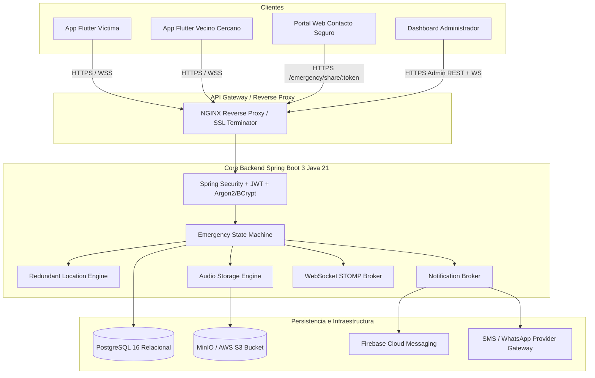

# Arquitectura del Sistema — RED AYUDA

## 1. Visión General
RED AYUDA es un sistema distribuido de alta disponibilidad diseñado para coordinar alertas tempranas de emergencia ciudadana en Ayacucho, Perú, con arquitectura preparada para escalamiento nacional.

## 2. Componentes Clave
1. **App Móvil (Flutter)**:
   - Patrón Clean Architecture: `core`, `data`, `domain`, `presentation`.
   - Botón SOS con protección de pulsación involuntaria (mantener presionado 3 segundos).
   - Cuenta regresiva de 10 segundos con cancelación segura protegida por PIN.
   - Mecanismo encubierto de protección física mediante PIN de coacción.
   - Tracking continuo en segundo plano.
2. **Backend (Spring Boot 3 / Java 21)**:
   - Framework robusto y reactivo con Spring Security, Spring Data JPA y WebSockets STOMP.
   - Máquina de estados finita inmutable para el ciclo de vida del incidente.
   - Motor geoespacial redundante (GPS satelital, aproximada de red, última conocida).
   - Abstracción desacoplada de almacenamiento de audio (Local y AWS S3/MinIO con URLs firmadas temporales).
   - Despachador multicanal de alertas (Push FCM, SMS, WhatsApp, Email) con proveedor DEV claramente auditado.
3. **Persistencia (PostgreSQL 16)**:
   - Esquema normalizado con migraciones automatizadas gestionadas con Flyway (`V1__initial_schema.sql`, `V2__seed_dev_data.sql`).
   - Índices estratégicos para búsquedas espaciales y temporales de incidentes.
4. **Portal Web y Dashboard (Vite / Vanilla JS / Leaflet)**:
   - Vista compartida pública protegida por token criptográfico de alta entropía (`/emergency/share/:token`).
   - Centro de control administrativo con telemetría en tiempo real y mapa interactivo OpenStreetMap.
