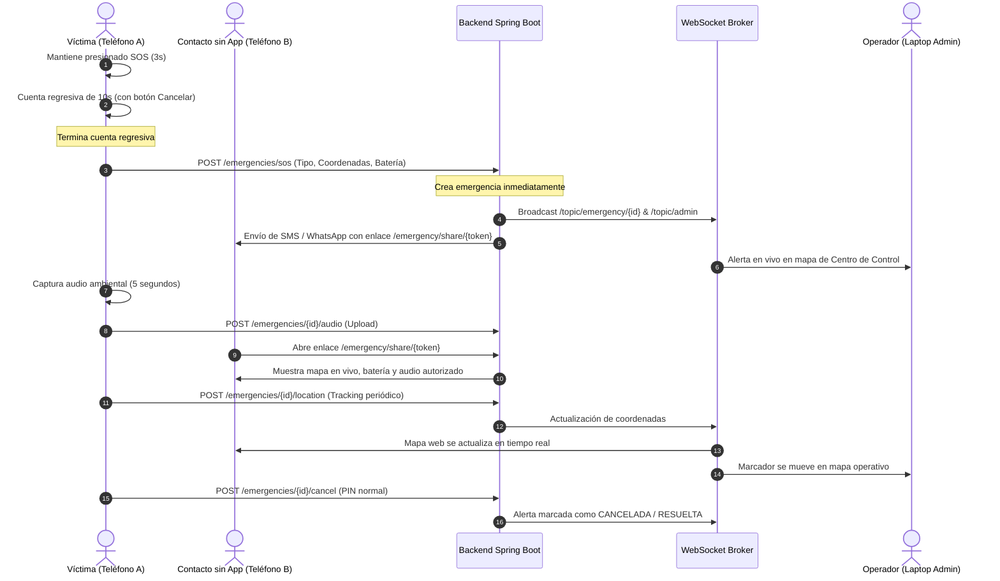

# Flujo de Emergencia — RED AYUDA

## 1. Demostración del Ciclo Completo (Víctima, Contacto y Centro de Control)

## 2. Regla Crítica del Orden de Ejecución
NUNCA esperar a que el audio termine de grabarse para crear la emergencia.
1. Termina cuenta regresiva.
2. Crear emergencia inmediatamente en backend.
3. Guardar primera ubicación disponible.
4. Despachar avisos a contactos y usuarios cercanos.
5. Iniciar grabación y subida asíncrona del audio.
6. Mantener tracking periódico.
